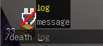
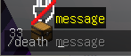
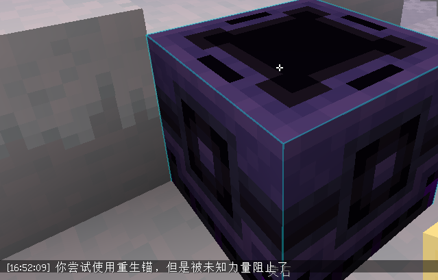
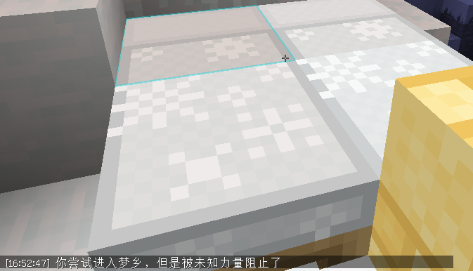
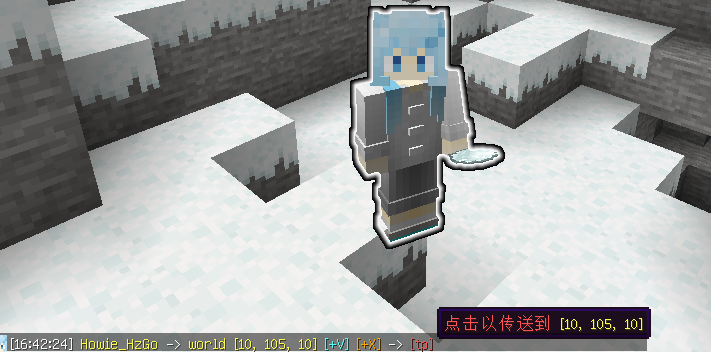
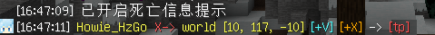
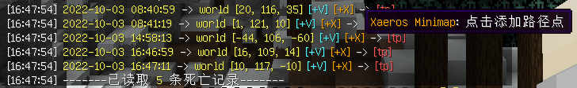

# Points

A paper plugin, some useful points

插件支持 1.16.5 1.17.1 1.18.2 1.19.2 **paper及其衍生端**

插件最低要求为 **java16**

## 主要功能

1. 高亮自身 公屏发坐标 (/here指令)
2. 得到某个玩家的坐标 (/where指令)
3. 死亡的时候发送死亡位置 (/death指令)
4. 记录死亡信息 (/death指令)
5. 随身开启末影箱 (/enderchest指令)
6. 防爆

**其他**

1. 高可配置性，各个模块都可以单独关闭
2. 权限支持 * 通配符
3. 开箱即用 -> 默认配置文件: 作用于自身的指令无需权限，作用于他人的权限和reload指令需要权限
4. tab补全根据 模块是否开启 和 是否有权限 自动隐藏

有权限的玩家看到的

无权限玩家看到的

5. 完全可配置的语言文件

## 功能介绍

### 防爆 anti-boom

(对于床和重生锚来说是阻止使用)

* 床 -> bed
* 苦力怕 -> creeper
* 末影水晶 -> ender-crystal
* 恶魂 -> ghast
* tnt矿车 -> minecart-tnt
* 重生锚 -> respawn-anchor
* TNT -> tnt
* 凋零 -> wither

### 指令和权限枚举

#### /here (/he)

    高亮自身 公屏发坐标
    points.command.here

#### /where (/whe, /wh)

    获取自己坐标
    points.command.where.self
    
    /where Shacha086
    获取玩家坐标
    points.command.where.other
    points.command.where.other.Shacha086 //对于特定玩家

#### /death (/de)

    /death message
    切换是否发送死亡坐标
    points.command.death.message

    是否发送死亡坐标 监听器管理
    points.listener.death.message

    /death log
    获取自己的死亡历史
    points.command.death.log.self

    /death log Shacha086
    获取玩家死亡历史
    points.command.death.log.other
    points.command.death.log.other.Shacha086 //对于特定玩家

#### /enderchest (/ec)

    /enderchest
    开启自己的末影箱
    points.command.enderchest.self

    /enderchest Shacha086
    开启指定玩家末影箱 (要求该玩家在线)
    points.command.enderchest.other
    points.command.enderchest.other.Shacha086 //对于特定玩家

#### points主指令 (/po)

    /points reload
    重载插件
    points.reload

    /points help
    获取帮助

## 构建

paper-api版本为1.16.5 向后兼容到1.19.2

最新开发版自动构建可在github action中下载

## 代码质量

Points使用 [sonarcloud.io](https://sonarcloud.io/project/overview?id=HowieHz_Points), [codacy.com](https://app.codacy.com/gh/HowieHz/Points/dashboard), [deepsource.io](https://deepsource.io/gh/HowieHz/Points) 监控代码质量

## 更新计划

1. 添加床和重生锚有爆炸伤害但不破坏地形的选项
2. 异步数据库操作
3. 重写部分类
4. 支持mysql等数据库存储
5. 配置文件占位符检查
6. 在服务器隐身（玩家列表也看不到的那种可以用来抓挂）
7. 右键打开潜影箱